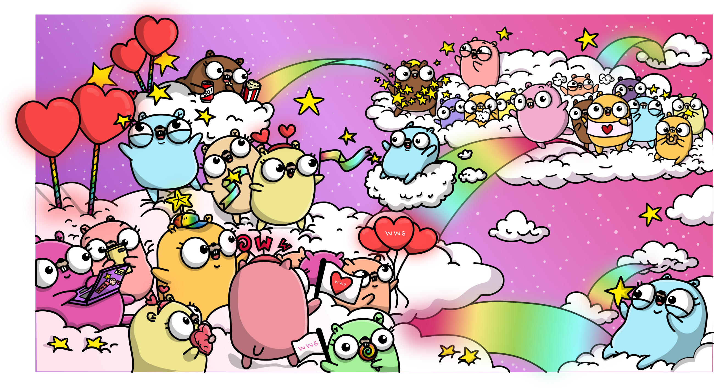

## GoBridge
GoBridge is a member of the non-profit organization [BridgeFoundry](https://bridgefoundry.org). At GoBridge we build bridges to educate underrepresented communities to teach technical skills and to foster diversity in Go.

Contact us at [support@gobridge.org](mailto:support@golangbridge.org) with any questions, issues or requests you may have.

#### Core Mission
Our core mission is to enable minorities in tech to use Go as a tool to learn and teach programming and, ultimately, to empower underrepresented groups in tech to help increase diversity in the Go community.

#### Core Vision
We believe education is most effective when it is tailored to and provided by local communities. We are dedicated to growing and supporting local teams of individuals and companies who will have ownership in the work they do. We are also dedicated to developing in-depth and idiomatic training materials. Our workshops are targeted at smaller, local Go communities, and not necessarily directly at the global Go community. But we believe that, as each individual in the Go community strengthens, the collective Go community will, in turn, strengthen as well.

### Time-Sensitive Initiatives
These are initiatives that have a time limit if you're interested in applying or helping.

* **Conference Diversity Scholarship Applications**  
[GopherCon USA](https://docs.google.com/forms/d/e/1FAIpQLSdUQRBruxKKepEiyVjN13SZdiBDeT7TOWKm6UM6PmqUOep6kA/viewform), [GopherCon EU](https://www.gophercon.es/#diversityscholarship), [OpenGo.io](https://opengo.io/diversity)

### Site Index
* [Current Initiatives](https://github.com/gobridge/about-us#current-initiatives)
* [Give a Talk or Presentation](https://github.com/gobridge/about-us#give-a-talk-or-presentation)
* [Online/Offline Communities](https://github.com/gobridge/about-us#online-communities)
* [Organize a Workshop](https://github.com/gobridge/about-us#organize-a-workshop)
* [Important Event Documents](https://github.com/gobridge/about-us#inportant-event-documents)
* [Become a Sponsor](https://github.com/gobridge/about-us#become-a-sponsor)
* [Donate What You Can](https://github.com/gobridge/about-us#donate-what-you-can)
* [Leadership Team](https://github.com/gobridge/about-us#leadership-team)

### Current Initiatives
We always have fun and exciting things we are working on to support the Go community. If you have time to help or you think one of these programs can help you, send us an [email](mailto:support@golangbridge.org).

* **Meetup accounts for Go user groups worldwide**  
If you run a Go user group anywhere on the planet we want to hear from you. Let us provide you a Meetup account for free to help support your efforts in your local community. If you want to start a new meetup, check out the [GDN FAQ](http://gdn-organizers.gobridge.org) for more information. View the GDN map of [Go Meetups](http://gdn.gobridge.org)

* **Running, Managing and Supporting Workshops**  
We love workshops and want to help. Many of our core members will travel to your local community to help you teach a workshop. We can help with finding sponsors or even grant money. We have material you can use if you're not sure where to begin.

* **Individual Mentoring**  
If you need more one-on-one time to help improve your Go coding skills, we have people ready to help. You just need to be ready to put in the hard work. We have Go challenges, algorithms, and other cool exercises to help you improve. We will provide code reviews and guidance. This platform will get you started whether you want to be a Mentor or you need a Mentor. [Mentoring Platform](https://mentoring.gobridge.org).

* **Growing Underrepresented Minority Participation**  
We are very focused on growing underrepresented minority participation at all of our events. This includes but is not limited to meetups, conferences and our online communities. We are doing this through diversity scholarships, mentoring speakers and providing support any way we can.

* **Asociația unPi pentru Școlari**  
We are helping kids in Romania learn Go buy providing familes access to Raspberry Pi's. To learn more check out this [site](https://start.unpi.ro/english/).

* **Administration**  
We always have little things that need to get done to keep the organization running. We are lucky to be in a field where tech is our focus. Outside of having to maintain the systems we rely on, there are other things we need to get in place. A big one is finding ways to collect analytics around how we are doing as an organization. Reviewing and defining our policies and procedures is another important job. Last but not least, keeping all our content and information relevant and up to date.

### Give a Talk or Presentation
We are here to support you in your quest to share your experience and knowledge in front of others. We have this document that can help get your ideas on paper and focused. We are here to work with you every step of the way.

[Talk Framework Worksheet](https://docs.google.com/document/d/16llwMgq38wIt19Oj-TrunrPsfczrCNgvIqioslcdb6Q)

### Online/Offline Communities
GoBridge has the responsibility of being the steward for online and offline Go communities. We work with an incredible team of administrators to make sure these sites/events are inclusive to the largest number of communities and viewpoints, with the most varied and diverse backgrounds possible.

* We provide Go user groups access to a free [Meetup](https://www.meetup.com/pro/go) account. This program is supported through generous contributions by Google. If you are currently running a user group or thinking about one, send us an [email](mailto:gdn@gobridge.org). We can help you get things started.

* Gophers [Slack](https://invite.slack.gobridge.org) is a thriving, real-time messaging community. If you are looking to get immediate answers to questions or join in the conversation about Go with other Gophers, this is the place to be.

* Go [Forum](https://forum.golangbridge.org/) is a site where ideas, views, questions, and answers can be exchanged and discussed. It also allows for all the content that is discussed to be indexed and searchable from the Web. If you are looking for historical answers to your questions, this is the place to search.

### Organize a Workshop
Want to get involved? [Organize](https://github.com/gobridge/organizing) a workshop in your area! We are here to help you every step of the way.

* Start by creating an [issue](https://github.com/gobridge/workshops/issues) in the workshops repo (issues represent upcoming and potential events, and hold to-do lists for each).

* Create one issue for each workshop you are planning. Please include a possible date and location. You can always edit the issue when you know more.

* If you need a grant to help support your event, fill out this [grant form](https://docs.google.com/forms/d/e/1FAIpQLSfKPyI0kcPqr18i18x-yErKoCayKMxylbhMBe4fdgDuMe6LYQ/viewform). A member of GoBridge will receive an email notification and will contact you promptly.

* If you are looking for more detailed information, this [workshop](https://github.com/gobridge/workshops) link will help.

### Important Event Documents
These are documents you will need when you are ready to publish your events online.

Please use this [policy](http://policies.golangbridge.org) document when providing attendees information about the standards and resolution procedures for your event. Make a copy and fill in the specifics about your organizers and contact information. This document includes a link to our [Code of Conduct](http://coc.golangbridge.org).

Review these [scholarship guidelines](https://github.com/gobridge/about-us/blob/master/scholarship_guidelines.md) before offering any kind of scholarship. Then use this [scholarship application](https://github.com/gobridge/about-us/blob/master/scholarship_app.md) when accepting scholarship applicants for your event. There are a lot of things to consider and we have listed many of them. A lot of this information is also perfect to document on your event site.

### Become a Sponsor
Most GoBridge workshops need some level of support. This can range from offering a space, paying for food or even travel expenses for trainers. If you or your company is interested in helping, please send us an [email](mailto:support@golangbridge.org).

### Donate What You Can
Contributions to GoBridge via BridgeFoundry allow thousands of volunteers across the world to teach workshops and provide resource to women and others who are underserved in access to technology and tech skills. Most workshops happen without needing any funds with companies providing space and food for our events. Providing food is an equalizer, making it so people who can’t afford to go out for lunch are not separated from those that can. Meals also provide a comfortable space for informal networking.

Your donation is fully tax-deductible. See [About BridgeFoundry](https://bridgefoundry.org/about) for more non-profit details, including their EIN.

When donating through BridgeFoundry please note the funds are for GoBridge.

[DONATE](https://bridgefoundry.org/donate)

### Leadership Team
These are our core members who make up the leadership team.

[Ashley McNamara](https://twitter.com/ashleymcnamara),
[Angelica Hill](https://twitter.com/Angelica_Hill),
[Carlisia Pinto](https://twitter.com/carlisia),
[Carmen Hernández Andoh](https://twitter.com/carmatrocity),
[Carolyn Van Slyck](https://twitter.com/carolynvs),
[Conrad Taylor](https://twitter.com/conradwt),
[Diana Ortega](https://twitter.com/dicaormu),
[Edward Muller](https://twitter.com/freeformz), 
[Johnny Boursiquot](https://twitter.com/jboursiquot),
[Maartje Eyskens](https://twitter.com/MaartjeME),
[Natalie Pistunovich](https://twitter.com/NataliePis),
[Sarah Allen](https://twitter.com/ultrasaurus),
[Wilken Rivera](https://twitter.com/wilkenrivera),
[William Kennedy](https://twitter.com/goinggodotnet)
